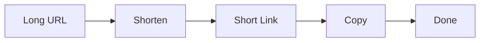

# URL Shortener

[](https://roxlink.vercel.app/)

A minimalist URL shortener built with React + Vite.



## Stack

**React 19 · Vite · Tailwind CSS 4 · Axios · Sonner · Three.js/Vanta**

## Quick Start

```bash
npm install
npm run dev
```

## Features

- Paste long URL → get short link
- One-click copy to clipboard
- Fog background effect
- Toast notifications
