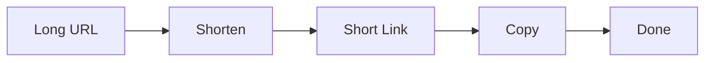

# URL Shortener

**Live:** [roxlink.vercel.app](https://roxlink.vercel.app/)

A minimalist URL shortener — paste a long URL, get a short link, copy it in one click.



## Stack

**Frontend** — React · Vite · Tailwind  
**API** — [shrtr.top](https://shrtr.top/) (third-party URL shortening)  
**UI** — Vanta.js (animated background)

## Features

- Shorten any URL instantly
- One-click copy to clipboard

## Quick Start

```bash
npm install
npm run dev
```

## Project Structure

```
src/
├── main.jsx          Entry point
├── App.jsx           Root component
├── index.css         Tailwind styles
└── components/
    ├── Fogbg.jsx          Vanta fog background
    ├── InputShortener.jsx URL input & shorten button
    └── LinkResult.jsx     Shortened link display & copy
```

## How It Works

The app sends a `POST` request to `https://shrtr.top/api/v1/shorten` with the user's URL and displays the returned short link. No backend — everything runs client-side.
