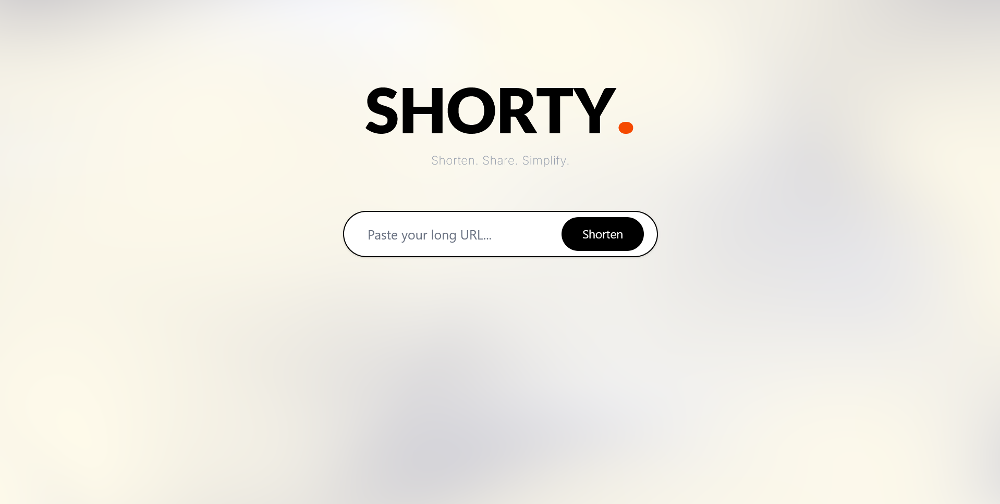

<div align="center">
  
  <h1>SHORTY</h1>
  <p><a href="https://roxlink.vercel.app/">roxlink.vercel.app</a></p>
</div>

<p align="center">
  
</p>

## Stack

React · Vite · Tailwind · Vanta.js · Sonner · [shrtr.top](https://shrtr.top/) API

## Quick Start

```bash
npm install
npm run dev
```

## Structure

```
src/
├── main.jsx
├── App.jsx
├── index.css
└── components/
    ├── Fogbg.jsx
    ├── InputShortener.jsx
    └── LinkResult.jsx
```

## How It Works

Paste a URL → validate → `POST` to `https://shrtr.top/api/v1/shorten` → display short link → copy in one click. All client-side, no backend.
